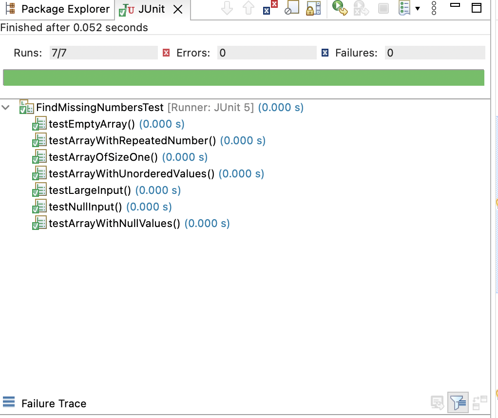
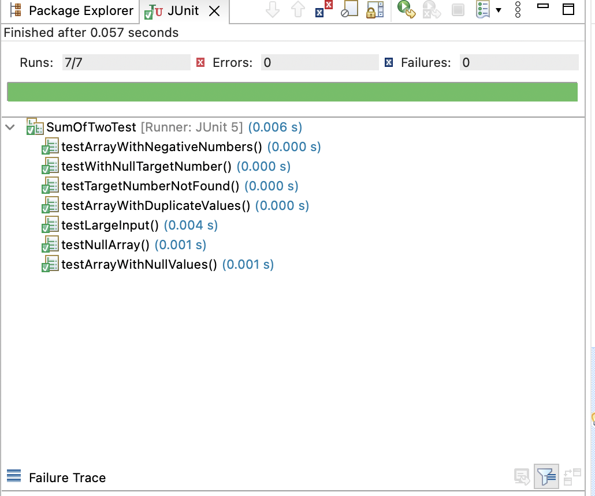

# ExamFullstackEngineer

Full stack engineer exam solution

## Find missing numbers

To find the missing values, first transform the input array into a set in order to use the contains method, so the search operation will be of O(1) complexity.
Then an integer stream of the array size is created and the values that are not found in the array created above are filtered out.

```
IntStream.range(1, originalLength+1).filter(e->!inputAsSet.contains(e));
```

Time complexity: O(n)
Space complexity: O(n)

Test cases: 




## Sum of two

Two nested loops are created to combine the different elements of an array, if the sum of the two selected elements (and the indices of the selected values are different) is equal to the target value, the indices of the found values are returned.

```
for(int i=0;i<input.length;i++) {
    for(int j=i+1; j<input.length;j++) {
        Integer firstValue = input[i];
        Integer secondValue = input[j];
        if(firstValue == null || secondValue == null) {
            continue;
        }
        if(firstValue+secondValue==targetNumber) {
            Integer[] result= {i,j};
            return result;
        }
    }
}
```

Time complexity: O(n^2)
Space complexity: O(n)

Test cases: 




